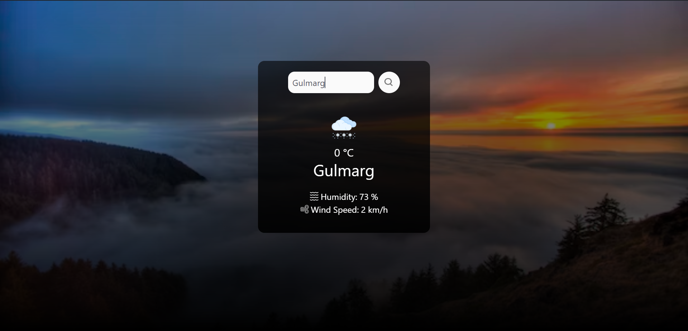

# Weather App

## Description
This is a simple weather application built using React. It allows users to search for weather information based on city names.

## Features
- Fetches weather data from the OpenWeatherMap API.
- Displays weather information including temperature, humidity, and wind speed.
- Provides icons representing different weather conditions.
- Allows users to search for weather data by city name.

## Technologies Used
- React
- HTML
- CSS (with Tailwind CSS)
- OpenWeatherMap API

## Setup Instructions
1. Clone the repository to your local machine.
2. Navigate to the project directory.
3. Install dependencies using `npm install`.
4. Obtain an API key from OpenWeatherMap and replace `api_key` in `WeatherApp.js` with your own API key.
5. Run the application using `npm start`.
6. Open your browser and navigate to `http://localhost:3000` to view the Weather App.

## Usage
- Enter a city name in the search bar and press Enter or click the search icon.
- Weather information for the specified city will be displayed.
- If the city name is not valid, an error message will be shown.
- 
## Screenshots

